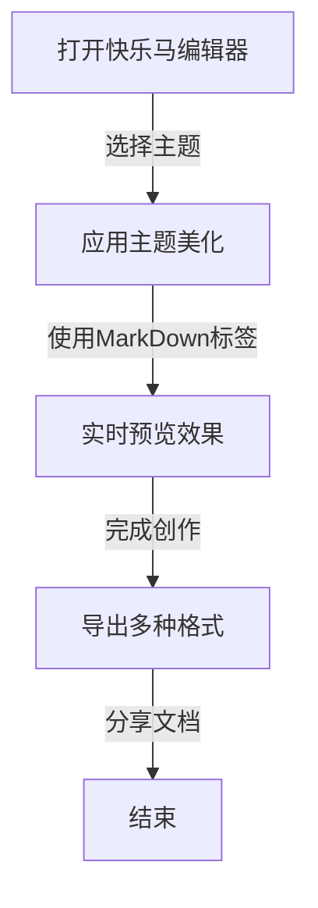

# 快乐马MarkDown编辑器，重新定义美化新体验

在这个内容为王、颜值至上的时代，MarkDown作为轻量级标记语言，早已成为程序员、文案创作者、学生、职场人必备的高效写作工具——它简洁、高效、易上手，无需繁琐排版，就能快速生成规范美观的文档。但市面上多数MarkDown编辑器，要么功能单一、美化效果拉胯，要么操作复杂、占用内存，让很多人陷入“写得高效，看得尴尬”的困境。

今天，我们隆重推出 **快乐马MarkDown编辑器** —— 一款以「全标签支持+极致主题美化为核心」的全能编辑器，不仅完美兼容MarkDown所有标准标签，更以精细化美化设计，让每一个标签、每一段文字都兼具质感与美感，无论是日常笔记、技术文档、文案创作，还是报告撰写、公众号排版，都能让你在高效写作的同时，收获视觉上的极致享受，彻底告别“单调排版”，让每一篇文档都成为专属作品。

# 一、全标签完美兼容，解锁MarkDown所有创作可能

快乐马MarkDown编辑器全面支持MarkDown所有标准标签，从基础的文本格式化，到复杂的图表、公式、代码块，每一处标签都能精准渲染，更搭配专属主题美化，让标签效果不再单调，兼顾专业性与观赏性。下面，我们结合主题美化效果，逐一展示所有标签的实操魅力，让你直观感受快乐马的强大。

## （一）基础文本标签：简约不简单，美化更细腻

基础文本标签是MarkDown写作的核心，快乐马打破“基础标签=单调样式”的固有认知，通过主题配色、字体优化、间距调整，让普通文本也能拥有高级质感，同时保留标签的简洁性，让写作更专注、呈现更美观。

### 1\. 标题标签（\# 至 \#\#\#\#\#\#）：层级清晰，颜值拉满

标题标签用于划分文档层级，快乐马为不同层级标题设计专属美化样式——一级标题加粗醒目、搭配主题主色调下划线，二级标题简洁大气、自带轻微阴影，三级及以下标题层次分明、配色柔和，既保证层级清晰，又避免视觉杂乱，适配不同主题风格（亮色、暗色、复古、极简等）。

示例效果（对应主题：治愈暖调）：

# # 一级标题：快乐马MarkDown编辑器核心优势（主色调暖橘色，加粗+底部细下划线）

## ## 二级标题：全标签兼容，美化无死角（暖黄色，加粗，轻微阴影）

### ### 三级标题：基础文本标签美化效果（暖灰色，加粗，无多余装饰）

#### #### 四级标题：标题标签的多样化适配（浅灰色，常规加粗）

##### ##### 五级标题：细节打磨，质感升级（浅灰色，轻度加粗）

###### ###### 六级标题：层级收尾，简洁利落（浅灰色，常规字体）

无论是学术报告的严谨层级，还是公众号文案的清晰结构，快乐马的标题标签美化都能精准适配，让文档结构一目了然，视觉体验更舒适。

### 2\. 文本强调标签：突出重点，风格统一

MarkDown的文本强调标签（加粗、斜体、删除线），在快乐马编辑器中被赋予了更细腻的美化设计，不同主题下，强调效果与整体风格高度统一，既突出重点，又不显得突兀。

示例效果：

- 加粗标签（**加粗文本**）：**快乐马MarkDown编辑器，颜值与实力双在线**（主题高亮色加粗，边缘柔和，不刺眼）

- 斜体标签（*斜体文本*）：*专注MarkDown美化，让写作更有仪式感*（轻微倾斜，配色柔和，贴合主题调性）

- 删除线标签（~~删除线文本~~）：~~传统编辑器单调排版，颜值拉胯~~（删除线颜色柔和，不遮挡原文，适配主题配色）

### 3\. 换行与分割线标签：细节美化，提升质感

换行（两个空格+回车）与分割线（--- / *** / ___）是文档排版的“隐形加分项”，快乐马对这两个标签进行了精细化美化，避免分割线生硬突兀，换行间距均匀，让文档排版更整洁、更有呼吸感。

示例效果：

这是换行标签的效果（两个空格+回车）
换行间距均匀，不拥挤、不松散，贴合整体排版节奏。

这是分割线标签的效果（---）

---

分割线采用主题渐变色，宽度适配文档页面，边缘圆润，不生硬，既能划分内容板块，又能作为视觉装饰，让文档更有层次感。无论是***、---还是___，快乐马都能自动美化，保持风格统一。

## （二）列表标签：规整有序，美化不杂乱

列表标签（无序列表、有序列表、嵌套列表）是整理内容、梳理逻辑的必备工具，快乐马打破传统列表的单调样式，为列表项设计专属图标、配色和间距，让列表既规整有序，又兼具美感，适配不同场景的创作需求（笔记整理、步骤说明、要点总结等）。

### 1. 无序列表（- / + / *）：图标多样，配色适配

快乐马为无序列表提供多种主题图标（圆点、方块、三角、星星等），图标颜色与主题主色调一致，间距均匀，避免列表拥挤，让每一项内容都清晰可见。

示例效果（对应主题：极简冷调）：

- 全标签兼容，支持MarkDown所有标准标签，无遗漏

- 主题美化精细化，每一处标签都有专属设计

- 轻量流畅，占用内存小，运行不卡顿

可自定义列表图标样式、颜色和间距，无论是简约风格还是活泼风格，都能轻松适配。

### 2. 有序列表（1. 2. 3.）：序号规整，视觉统一

有序列表用于梳理步骤、排序要点，快乐马优化了序号的字体、颜色和间距，序号与文本对齐整齐，避免出现序号错乱、间距不均的问题，同时序号颜色贴合主题，让列表更具质感。

示例效果：

1. 下载快乐马MarkDown编辑器，安装后打开

2. 选择喜欢的主题（亮色、暗色、复古等），一键应用

3. 使用MarkDown标签创作，实时预览美化效果

4. 完成创作后，可导出PDF、HTML、图片等多种格式

### 3. 嵌套列表：层级清晰，美化连贯

嵌套列表用于呈现复杂逻辑（比如“要点-子要点”），快乐马为不同层级的嵌套列表设计差异化美化样式，子列表图标更小、颜色更浅，与父列表形成明显区分，同时保持整体风格连贯，让复杂逻辑一目了然。

示例效果：

- 基础功能
    1. 全标签兼容，精准渲染
    2. 实时预览，所见即所得
- 美化功能
    1. 多主题切换，适配不同场景
    2. 自定义标签样式，打造专属风格

## （三）引用与代码标签：专业呈现，美化升级

引用标签（\&gt;）和代码标签（行内代码、代码块）是技术文档、学术报告、文案创作中常用的标签，快乐马针对这两个标签进行了专业化美化，既保证内容的专业性，又提升视觉体验，让引用更醒目、代码更易读。

### 1. 引用标签（>）：边框美化，风格统一

引用标签用于引用他人观点、名言警句或重要内容，快乐马为引用标签设计专属边框（左侧主题色细边框），背景色为主题浅色调，字体颜色稍深，既突出引用内容，又不与正文冲突，同时边框样式可根据主题调整，适配不同风格。

示例效果：

> MarkDown的核心价值的是“让写作回归内容本身”，而快乐马的核心使命，是让内容既高效，又好看——不辜负每一份用心创作，让每一篇文档都有属于自己的质感与风格。
> 
> 

### 2\. 代码标签：高亮美化，易读性拉满

代码标签分为行内代码（\`代码内容\`）和代码块（\`\`\`代码内容\`\`\`），快乐马针对代码标签进行了精细化高亮美化，支持多种编程语言（Python、Java、HTML、CSS等），不同语言的关键字、注释、字符串采用不同配色，同时代码块背景色贴合主题，边框圆润，间距合理，让代码更易读、更美观。

示例效果：

行内代码：使用 `pyinstaller -w -F 主程序.py` 命令，可打包Python程序（代码字体清晰，背景色为主题浅灰色，与正文区分明显）。

代码块（Python）：

```python
# 计算exe文件的MD5值
import hashlib

def calculate_md5(file_path):
    md5 = hashlib.md5()
    with open(file_path, 'rb') as f:
        while chunk := f.read(4096):
            md5.update(chunk)
    return md5.hexdigest()

# 调用函数
file_md5 = calculate_md5("长图切割工具.exe")
print(f"文件MD5值：{file_md5}")
```

快乐马支持自定义代码高亮配色、字体大小、代码块间距，无论是程序员写技术文档，还是学生整理代码笔记，都能获得极佳的阅读体验，同时代码块美化与整体主题高度统一，不显得突兀。

## （四）链接与图片标签：美观实用，交互友好

链接（`[链接文本](链接地址)`）和图片（``）是丰富文档内容的重要标签，快乐马对这两个标签进行了美化优化，让链接更醒目、图片更贴合文档风格，同时支持交互效果，提升使用体验。

### 1. 链接标签：配色醒目，hover效果贴心

快乐马为链接标签设计专属配色（主题高亮色），链接文本自带轻微下划线，hover时下划线变粗、颜色加深，既突出链接，又不显得杂乱，同时可自定义链接颜色、下划线样式，避免链接与正文混淆。

示例效果：

点击前往 [快乐马MarkDown编辑器官网](javascript:void(0);) 下载最新版本，解锁更多美化功能（链接为主题高亮色，hover时颜色加深，下划线变粗）。

同时支持自动链接（<链接地址>），自动渲染为可点击链接，美化效果与普通链接一致，无需额外操作。示例：<https://www.markdown.com>

### 2. 图片标签：自适应排版，美化无死角

图片标签用于插入图片，快乐马支持图片自适应文档宽度，避免图片过大或过小，同时为图片添加轻微阴影和圆角，让图片更具质感，图片alt文本颜色贴合主题，当图片无法加载时，alt文本清晰可见，不影响文档阅读。

示例效果：


（图片自适应宽度，圆角阴影，贴合主题风格）

更贴心的是，快乐马支持图片拖拽上传、批量上传，上传后自动优化图片大小，同时可自定义图片边框、阴影、圆角，让图片与文档整体风格高度统一，无论是插入截图、素材图，还是风景图，都能完美适配。

## （五）表格标签：规整美观，细节拉满

表格标签用于呈现结构化数据（比如对比、统计、清单等），传统编辑器的表格样式单调、边框生硬，快乐马对表格标签进行了全面美化，表格边框柔和、配色贴合主题，表头与表体区分明显，行间距均匀，让表格既规整又美观，同时支持表格对齐、单元格合并，满足多样化需求。

示例效果（对应主题：复古暖调）：

|快乐马MarkDown编辑器核心功能|标签支持|美化效果|适用场景|
|---|---|---|---|
|基础文本编辑|标题、强调、换行、分割线|配色柔和，细节细腻|日常笔记、文案创作|
|列表编辑|无序列表、有序列表、嵌套列表|图标适配，层级清晰|要点整理、步骤说明|
|专业内容编辑|引用、代码块、公式|高亮清晰，专业美观|技术文档、学术报告|
|多媒体编辑|链接、图片、图表|自适应排版，风格统一|公众号排版、PPT素材|

可自定义表格边框颜色、表头背景色、行间距、单元格对齐方式，无论是简单的两列表格，还是复杂的多列统计表格，都能完美呈现，兼顾实用性与美观度。

## （六）高级标签：拓展创作边界，美化不设限

除了基础标签，快乐马还完美支持MarkDown高级标签（公式、图表、任务列表、表情符号等），并对这些标签进行了专属美化，让高级功能不仅好用，更耐看，拓展你的创作边界，满足更多场景的创作需求。

### 1. 公式标签（行内公式 / 块级公式）：专业渲染，美观易懂

公式标签用于插入数学公式、物理公式、化学公式等，快乐马内置KaTeX引擎，支持所有LaTeX公式语法，同时对公式进行美化，公式颜色贴合主题，字体清晰，间距合理，让专业公式也能拥有美观的呈现效果，适配学术报告、技术文档、学生笔记等场景。

示例效果：

行内公式：勾股定理可表示为 $a^2 + b^2 = c^2$（公式字体清晰，颜色贴合主题，与正文协调）。

块级公式：

$$\int_{a}^{b} f(x) dx = F(b) - F(a)$$

块级公式居中显示，背景色为主题浅灰色，边框圆润，与文档整体风格高度统一，让专业公式不再单调。

### 2. 任务列表标签（- [ ] / - [x]）：直观清晰，美化贴心

任务列表标签用于整理待办事项、任务清单，快乐马为任务列表设计专属美化样式，未完成任务（- [ ]）的复选框为主题浅色调，已完成任务（- [x]）的复选框为主题主色调，勾选后文本自动添加轻微删除线，既直观清晰，又兼具美感，适配日常待办、工作规划、项目管理等场景。

示例效果：

- [x] 下载快乐马MarkDown编辑器

- [x] 选择喜欢的主题并应用

- [ ] 尝试使用所有MarkDown标签

- [ ] 导出文档并分享

### 3. 表情符号（Emoji）：活泼灵动，适配主题

快乐马支持所有MarkDown表情符号（:smile: :star: :heart: 等），并对表情符号进行了大小优化，让表情符号与文本适配，颜色贴合主题，既活泼灵动，又不显得突兀，为文档增添趣味性，适配日常笔记、文案创作、社交分享等场景。

示例效果：

快乐马MarkDown编辑器✨，全标签支持✅，主题美化💖，让写作更高效、更有仪式感🎉！

### 4. 图表标签（Mermaid）：可视化呈现，美化升级

图表标签用于插入流程图、时序图、类图等，快乐马内置Mermaid引擎，支持多种图表类型，同时对图表进行主题美化，图表颜色、线条样式贴合当前主题，让可视化图表更美观、更专业，无需额外设计工具，就能快速生成高颜值图表，适配技术文档、项目规划、方案汇报等场景。

示例效果（流程图）：



图表颜色、线条样式与主题高度统一，节点圆润，线条流畅，让复杂逻辑可视化，同时兼顾美观度，让文档更具专业性。

# 二、极致主题美化，不止是兼容，更是惊艳

如果说全标签兼容是快乐马的“硬实力”，那么极致主题美化就是它的“软实力”。快乐马深知，每个人的审美不同，创作场景也不同，因此打造了多套风格各异的主题，每一套主题都经过精细化打磨，从配色、字体、间距，到每一个标签的美化细节，都力求完美，让你无论喜欢哪种风格，都能找到适合自己的那一款。

## （一）多主题全覆盖，适配所有场景

快乐马内置10+套专属主题，涵盖不同风格，适配不同创作场景和审美需求，一键切换，瞬间改变文档整体风格，无需手动调整任何标签样式。

- **极简冷调**：黑白灰为主色调，简洁大气，标签美化低调内敛，适合技术文档、学术报告，凸显专业性；

- **治愈暖调**：暖橘、浅黄为主色调，柔和舒适，标签美化细腻温柔，适合日常笔记、文案创作，缓解视觉疲劳；

- **复古文艺**：米白、墨绿为主色调，自带复古质感，标签美化兼具古典与现代，适合散文、随笔、公众号排版；

- **活力亮调**：亮色为主色调，活泼灵动，标签美化鲜艳醒目，适合年轻人、社交文案、短视频脚本；

- **护眼模式**：低饱和度配色，柔和不刺眼，标签美化贴合护眼需求，适合长时间写作、学生笔记。

更重要的是，所有主题都对MarkDown所有标签进行了专属适配，切换主题后，所有标签的美化效果会自动同步，无需重新调整，让你轻松切换风格，收获不一样的视觉体验。

## （二）自定义美化，打造专属风格

如果内置主题无法满足你的个性化需求，快乐马支持全面自定义美化，让你亲手打造专属的MarkDown标签样式，每一处细节都由你掌控。

- 配色自定义：可调整主题主色调、辅助色、文本色、背景色，让标签颜色贴合你的喜好；

- 字体自定义：可选择字体、调整字体大小、行间距，让文本和标签更易读；

- 标签样式自定义：可调整标题下划线、引用边框、代码块阴影、表格边框等，让每一个标签都有专属风格；

- 布局自定义：可调整文档边距、列表间距、表格间距，让文档排版更贴合你的创作习惯。

无需专业设计知识，只需简单调整，就能打造出独一无二的MarkDown美化风格，让你的文档更具个人特色，告别千篇一律的单调排版。

## （三）实时预览，所见即所得

快乐马支持实时预览功能，你在输入MarkDown标签的同时，右侧会实时显示美化后的效果，无论是标签样式、主题配色，还是排版布局，都能实时查看，无需等待导出，让你随时调整，确保每一处标签都能达到你想要的美化效果。

同时，预览界面支持缩放、全屏，让你更清晰地查看文档整体效果，避免细节遗漏，让创作更高效、更省心。

# 三、不止是美化，更是全能实用的创作助手

快乐马MarkDown编辑器，不仅在标签美化上做到极致，更兼顾实用性和便捷性，内置多种实用功能，让你在享受美化体验的同时，提升创作效率，满足更多场景的创作需求。

## 1. 多格式导出，适配全场景

支持导出PDF、HTML、Word、图片（PNG/JPG）等多种格式，导出后标签美化效果完美保留，无论是提交报告、分享文档，还是发布公众号、小红书，都能轻松适配，无需重新排版。

## 2. 云端同步，多设备互通

支持云端同步功能，你的文档、主题设置、自定义样式，都能同步到所有设备（电脑、手机、平板），随时随地打开编辑，无需担心文档丢失，让创作更自由。

## 3. 轻量流畅，无广告无捆绑

快乐马体积小巧，占用内存小，运行流畅，无任何广告和捆绑软件，让你专注于创作本身，不被无关干扰，体验更纯粹。

## 4. 新手友好，易上手

界面简洁直观，操作简单，即使是第一次使用MarkDown的新手，也能快速上手，同时内置标签快捷键、模板库，让你快速掌握所有标签用法，提升创作效率。

# 四、为什么选择快乐马MarkDown编辑器？

市面上的MarkDown编辑器有很多，但能做到“全标签兼容+极致主题美化+全能实用”的，唯有快乐马。

- 对比传统编辑器：快乐马打破单调排版，让每一个MarkDown标签都有美化效果，颜值与实力双在线；

- 对比同类美化编辑器：快乐马全标签完美兼容，无任何遗漏，同时主题更丰富、自定义性更强，适配更多场景；

- 对比专业设计工具：快乐马无需专业知识，一键美化、实时预览，让普通人也能轻松打造高颜值文档，高效又省心。

无论是程序员、文案创作者、学生，还是职场人，无论你是用于技术文档、日常笔记、文案创作，还是报告撰写、公众号排版，快乐马MarkDown编辑器都能满足你的需求——让每一个MarkDown标签都发挥极致价值，让每一篇文档都兼具质感与美感，让写作成为一种享受。
